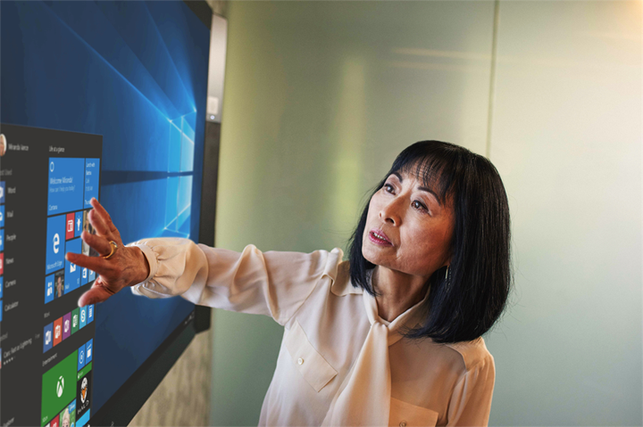
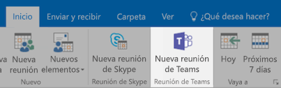
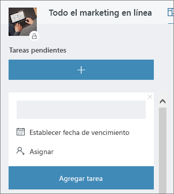

# Reunión en la oficinaMeeting at the Office

Son las diez de la mañana y va a empezar su reunión.It's 10:00 AM and time for your meeting. En esta sección, le mostraremos cómo hacer que las reuniones sean más productivas.In this section, we'll show you how to make your meetings more productive.  Lo que conlleva los procedimientos recomendados para la preparación de reuniones y las herramientas de Office 365.This involves best practices for meeting preparation and Office 365 tools.  

## HerramientasTools
- OutlookOutlook
- Microsoft TeamsMicrosoft Teams
- Skype EmpresarialSkype for Business
- OneNoteOneNote

## Lista de comprobación de la reuniónChecklist for your meeting
- Planificar y reservar la reuniónPlan and book your meeting
- Unirse a la reuniónJoin a meeting
- Presentar información en la reuniónPresent information in a meeting
- Usar OneNote en la reunión para crear contenido conjuntamente y tomar notasUse OneNote in a meeting for co-creation and notes
- Usar Planner en la reunión para hacer un seguimiento de los elementos de acción de un proyectoUse Planner in a meeting to track action items for that project
- Finalizar la reuniónEnd a meeting
 
## Planificar y reservar la reuniónPlan and book your meeting
Puede hacer unas cuantas cosas para asegurarse de que la reunión sea lo más productiva posible:There are a few things you can do to ensure your meeting is as productive as possible:

1. **¿Necesita una reunión?****Do you need a meeting?** Tenga en cuenta que primero puede compartir un archivo en el chat con los aprobadores necesarios.Consider sharing a file in chat with the necessary approvers first.  
1. **Tenga una agenda clara.****Have a clear agenda.**  Incluya la agenda de la reunión en la sección de notas de la invitación a la reunión en línea, de modo que los asistentes puedan prepararse.Include your meeting agenda in the notes section of your online meeting invitation so attendees can be prepared.
1. **Grabe la reunión** Use las funciones de grabación de la reunión de Microsoft Teams para compartir la reunión con personas que no puedan asistir, o para transcribir notas más tarde.**Record your meeting**  Use meeting recording functions in Microsoft Teams to share the meeting with people who could not attend or to transcribe notes later.  

Ya lo tiene todo preparado para reservar la reunión: reserve la reunión en Outlook con los detalles de Microsoft Teams o Skype Empresarial.Now you're ready to book that meeting:  Book the meeting with Microsoft Teams or Skype for Business details in Outlook. De este modo, podrá incluir miembros del equipo de distintas ubicaciones, grabar la reunión y usar el vídeo (cuando esté disponible) para que la comunicación sea más eficaz.Doing so enables you to include team members from different locations, record the meeting and utilize video (when available) to enhance communication. 

## Unirse a la reuniónJoin a meeting
Unirse desde cualquier lugar:Join from anywhere. Es posible unirse a una reunión de Microsoft Teams o Skype Empresarial desde cualquier lugar mediante un dispositivo móvil, ya sea llamando al número de acceso telefónico de los detalles de la reunión o usando las aplicaciones móviles.It is possible to join a Microsoft Teams or Skype for Business meeting from anywhere using a mobile device, either by calling the dial-in number in the meeting details or using the mobile apps. Si usa las aplicaciones móviles, tenga en cuenta los límites de uso de datos móviles que se aplican en su país o región.When using the mobile apps, be conscious of mobile data usage limits that apply to you or your country.

> [!TIP]
> **Use auriculares.****Use a headset.** Si se va a conectar desde el equipo de su escritorio, use auriculares en lugar del micrófono y los altavoces integrados del equipo para que la calidad de la llamada sea mejor.If you are connecting from your computer at your desk, use a headset rather than your computer's built-in microphone and speakers to ensure a better call quality.

> [!TIP]
> Active el vídeo.Turn on your video! Si hay cámaras disponibles, merece la pena usarlas, ya que en la comunicación cara a cara se dan pistas no verbales que se perderían al usar solo la voz.When cameras are available, it's worth using them, as face-to-face communication provides non-verbal cues that can be missed when just using voice. No se preocupe, tiene un aspecto fabuloso.Don't worry, your hair looks great. 

## Presentar información en la reuniónPresent information in a meeting
Compartir contenido desde el dispositivo es una buena forma de centrar la reunión y dar contexto a la discusión.Sharing content from your device is a great way to focus your meeting and provide context to the discussion. Por lo general, no es muy buena idea compartir toda la pantalla.In general, sharing your entire screen can be a bad idea. Eso implica que todo lo que se muestre en la pantalla aparecerá en las pantallas de todos los asistentes de la reunión.It means that everything that comes up on your screen will appear on the screens of everyone attending the meeting. Para evitarlo, no tiene más que seleccionar el contenido que quiere compartir en Microsoft Teams.Avoid this by simply selecting the content you want to share in Microsoft Teams. 

## Usar OneNote en una reuniónUse OneNote in a meeting
OneNote permite la colaboración en tiempo real y la creación conjunta de contenido, por lo que es una herramienta excelente para compartir ideas y tomar notas en las reuniones.OneNote can allow for real-time collaboration and co-creation, making it an ideal tool for brainstorming and note taking in meetings. Siempre que todos los usuarios tengan acceso a la ubicación en la que se comparte OneNote, podrá publicar un vínculo al bloc de notas y empezar a compartir ideas de inmediato.As long as everyone has access to the location where the OneNote is shared, you can post a link to the notebook and start brainstorming right away.

Puede crear una sección específica para las notas de la reunión en el bloc de notas del equipo.You can create a specific section for meeting notes in the team notebook. También puede usar la función de "detalles de la reunión" de OneNote para crear páginas con un resumen de los detalles de la reunión.You can also use the "meeting details" functionality in OneNote to create pages with a summary of the details of the meeting.

## Usar Planner en una reuniónUse Planner in a meeting
Si agrega elementos de acción directamente a un plan del proyecto, se ahorrará tener que transcribirlos después.Directly adding action items into a plan for your project saves you from transcribing them after the fact. Uno de los procedimientos recomendados para las reuniones de proyectos grandes es designar a alguien para que haga un seguimiento de las acciones y tome notas.It's a best practice in large project meetings to assign someone to action tracking & note taking. Por lo general, es una persona diferente de la persona que dirige la reunión.This is normally a different person than the individual running the meeting. Los recordatorios de elementos de acción se envían directamente a la persona designada, así como los recordatorios si el elemento sobrepasa la fecha de vencimiento.Action item reminders are sent directly to the individual to whom it is assigned as are reminders if the item passes it's due date. 

## Finalizar la reuniónEnd a meeting
Cuando se haya analizado todo lo que consta en la agenda, finalice la reunión, independientemente de la hora que sea.When everything on the agenda has been discussed, end the meeting, regardless of the time. Asigne y envíe elementos de acción a todos los participantes.Assign and send action items to all participants. Si está colaborando en Microsoft Teams, puede compartir fácilmente los elementos de acción en el canal correspondiente.If you are collaborating in Microsoft Teams, you can easily share action items in the appropriate channel. Los elementos de acción también pueden especificarse y asignarse durante la reunión en Planner, lo que permite hacer un seguimiento rápido para su finalización, a lo que también se puede [acceder en Microsoft Teams](https://support.office.com/es-ES/article/use-planner-in-microsoft-teams-62798a9f-e8f7-4722-a700-27dd28a06ee0).Action items can also be entered and assigned in Planner during the meeting, providing a fast way to track for completion which can also be [accessed in Microsoft Teams](https://support.office.com/es-ES/article/use-planner-in-microsoft-teams-62798a9f-e8f7-4722-a700-27dd28a06ee0). 