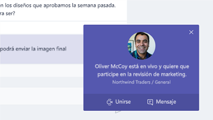

# En la oficina de la reuniónMeeting at the Office

Es 10:00 AM y hora para la reunión. En esta sección, le mostraremos cómo aumentar la productividad de las reuniones.  Esto implica procedimientos recomendados para la preparación de la reunión y herramientas de Office 365.It's 10:00 AM and time for your meeting. In this section, we'll show you how to make your meetings more productive.  This involves best practices for meeting preparation and Office 365 tools.  

## HerramientasTools
- OutlookOutlook
- Microsoft TeamsMicrosoft Teams
- Skype EmpresarialSkype for Business
- OneNoteOneNote

## Lista de comprobación para la reuniónChecklist for your meeting
- Plan y book la reuniónPlan and book your meeting
- Unirse a una reuniónJoin a meeting
- Presentar la información en una reuniónPresent information in a meeting
- Usar OneNote en una reunión para la creación de compañeros y notasUse OneNote in a meeting for co-creation and notes
- Usar el organizador en una reunión para realizar un seguimiento de los elementos de acción para el proyectoUse Planner in a meeting to track action items for that project
- Finalizar una reuniónEnd a meeting
 
## Plan y book la reuniónPlan and book your meeting
Hay algunas cosas que puede hacer para asegurarse de que la reunión es lo más productiva posibles:There are a few things you can do to ensure your meeting is as productive as possible:

1. **Necesita una reunión?** Considere la posibilidad de uso compartido de un archivo en una conversación con los aprobadores necesarios en primer lugar.**Do you need a meeting?** Consider sharing a file in chat with the necessary approvers first.  
1. **Tienen una agenda borrar.**  Incluir la agenda de la reunión en la sección Notas de la invitación a la reunión en línea para que los asistentes pueden estar preparados.**Have a clear agenda.**  Include your meeting agenda in the notes section of your online meeting invitation so attendees can be prepared.
1. **Registro de la reunión**  Usar funciones de grabación de la reunión en Microsoft Teams para compartir la reunión con personas que no se pudieran asistir a o notas más adelante.**Record your meeting**  Use meeting recording functions in Microsoft Teams to share the meeting with people who could not attend or to transcribe notes later.  

Ahora estará listo para dicha reunión del libro: libro de la reunión con Microsoft Teams o Skype para la empresa se detalla en Outlook. Con ello, podrá incluir a los miembros del equipo desde diferentes ubicaciones, grabar la reunión y utilizar vídeo (si está disponible) para mejorar la comunicación.Now you're ready to book that meeting:  Book the meeting with Microsoft Teams or Skype for Business details in Outlook. Doing so enables you to include team members from different locations, record the meeting and utilize video (when available) to enhance communication. 

## Unirse a una reuniónJoin a meeting
Unirse a desde cualquier lugar. Es posible unirse a un Microsoft Teams o Skype para la reunión de negocios desde cualquier lugar mediante un dispositivo móvil, ya sea llamando el número telefónico en detalles de la reunión o el uso de las aplicaciones móviles. Al usar las aplicaciones móviles, ser conscientes de los límites de uso de datos móviles que se aplican a usted o a su país o región.Join from anywhere. It is possible to join a Microsoft Teams or Skype for Business meeting from anywhere using a mobile device, either by calling the dial-in number in the meeting details or using the mobile apps. When using the mobile apps, be conscious of mobile data usage limits that apply to you or your country.

> [!TIP]
> **Usar unos auriculares.** Si va a conectar desde el equipo en su escritorio, usar unos auriculares en lugar de micrófono integrado del equipo y los altavoces para garantizar una mejor calidad de la llamada.**Use a headset.** If you are connecting from your computer at your desk, use a headset rather than your computer's built-in microphone and speakers to ensure a better call quality.

> [!TIP]
> ¡Activar el vídeo! Cuando las cámaras están disponibles, merece la pena de uso de las mismas, como comunicación cara a cara proporciona indicaciones de no verbal que se pueden perder cuando se usa sólo voz. No se preocupe, el proceso tenga un aspecto óptimo.Turn on your video! When cameras are available, it's worth using them, as face-to-face communication provides non-verbal cues that can be missed when just using voice. Don't worry, your hair looks great. 

## Presentar la información en una reuniónPresent information in a meeting
Uso compartido de contenido desde su dispositivo constituye una excelente manera centrarse la reunión y proporcionar contexto para la discusión. En general, el uso compartido de toda la pantalla puede ser una buena idea. Esto significa que todo lo que aparece en la pantalla aparecerá en las pantallas de todos los asistentes a la reunión. Para evitar esto, basta con seleccionar el contenido que desea compartir en Microsoft Teams.Sharing content from your device is a great way to focus your meeting and provide context to the discussion. In general, sharing your entire screen can be a bad idea. It means that everything that comes up on your screen will appear on the screens of everyone attending the meeting. Avoid this by simply selecting the content you want to share in Microsoft Teams. 

## Usar OneNote en una reuniónUse OneNote in a meeting
OneNote puede permitir para la colaboración en tiempo real y creación de compañeros, haciendo que sea una herramienta ideal para lluvia de ideas y tenga en cuenta teniendo en las reuniones. Siempre y cuando todo el mundo tiene acceso a la ubicación donde se comparte la OneNote, puede publicar un vínculo en el Bloc de notas e iniciar ideas inmediatamente.OneNote can allow for real-time collaboration and co-creation, making it an ideal tool for brainstorming and note taking in meetings. As long as everyone has access to the location where the OneNote is shared, you can post a link to the notebook and start brainstorming right away.

Puede crear una sección específica de notas en el Bloc de notas de equipo de la reunión. También puede usar la funcionalidad de "detalles de la reunión" de OneNote para crear páginas con un resumen de los detalles de la reunión.You can create a specific section for meeting notes in the team notebook. You can also use the "meeting details" functionality in OneNote to create pages with a summary of the details of the meeting.

## Usar el organizador en una reuniónUse Planner in a meeting
Agregar directamente los elementos de acción en un plan para el proyecto, guarda desde ellos transcripción después del hecho. Es una práctica recomendada en las reuniones de proyecto grande para asignar a una persona a la acción de seguimiento de toma de notas de &. Éste es normalmente una persona diferente la persona que ejecuta la reunión. Avisos de elemento de acción se envían directamente a la persona a quien se asigna como son avisos si el elemento pasa su fecha de vencimiento.Directly adding action items into a plan for your project saves you from transcribing them after the fact. It's a best practice in large project meetings to assign someone to action tracking & note taking. This is normally a different person than the individual running the meeting. Action item reminders are sent directly to the individual to whom it is assigned as are reminders if the item passes it's due date. 

## Finalizar una reuniónEnd a meeting
Cuando se ha explicado todo el contenido de la agenda, finalizará la reunión, independientemente de la hora. Asignar y enviar elementos de acción a todos los participantes. Si están colaborando en Microsoft Teams, puede compartir fácilmente los elementos de acción en el canal apropiado. Elementos de acción también pueden escribirse y asignados en Organizador durante la reunión, que proporciona una forma rápida de realizar el seguimiento de finalización que también se puede [tener acceso a en los equipos de Microsoft](https://support.office.com/en-us/article/use-planner-in-microsoft-teams-62798a9f-e8f7-4722-a700-27dd28a06ee0).When everything on the agenda has been discussed, end the meeting, regardless of the time. Assign and send action items to all participants. If you are collaborating in Microsoft Teams, you can easily share action items in the appropriate channel. Action items can also be entered and assigned in Planner during the meeting, providing a fast way to track for completion which can also be [accessed in Microsoft Teams](https://support.office.com/en-us/article/use-planner-in-microsoft-teams-62798a9f-e8f7-4722-a700-27dd28a06ee0). 