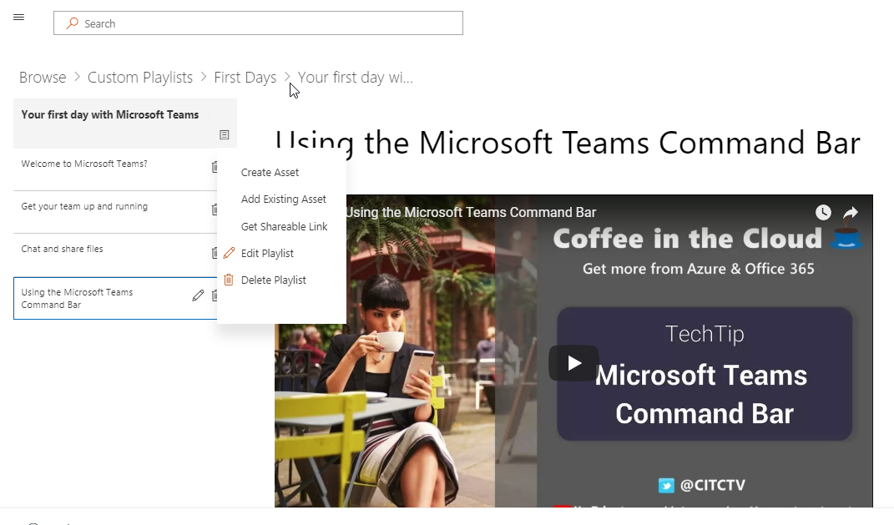

# Aprendizaje personalizado para Office 365

## Soluciones de aprendizaje personalizables y de autoservicio de Microsoft

Aprendizaje personalizado para Office 365 es un conjunto de herramientas de código abierto de aprendizaje y adopción diseñadas para aumentar el uso de Office 365 en su organización. Creadas en asociación con Microsoft Teams y los grupos de ingeniería de productos de SharePoint y el equipo de asistencia y experiencia modernos, estas soluciones fáciles de usar pueden instalarse y personalizarse en el espacio empresarial de SharePoint Online. 

Estas soluciones aportan a sus usuarios finales todo el contenido de aprendizaje que Microsoft tiene para ofrecer y mantener el contenido actualizado a petición.  El sitio puede integrarse fácilmente con la instalación de Microsoft Teams u otros sitios de SharePoint online existentes en su empresa.

Nuestro contenido de aprendizaje personalizado se encuentra actualmente en el ámbito inicial para los productos de Office 365 y Windows 10.  Si le gustaría ver más contenido incluido, envíenos [sugerencias y comentarios](feedback.md) en nuestro foro en línea.  

## Componentes de código abierto de aprendizaje personalizado

Aprendizaje personalizado para Office 365 proporciona dos opciones: 

**Opción 1**: [el paquete del sitio de aprendizaje personalizado de SharePoint Online](installsitepackage.md)

Seleccione, instale y configure este paquete de sitio de comunicación de SharePoint Online para crear un portal de aprendizaje para su empresa. Anteriormente conocido como kit de herramientas para el trabajo en equipo, este portal de aprendizaje se puede personalizar para agregar la ayuda, soporte técnico y contenido de la comunidad de la organización. También puede quitar cualquier contenido relacionado con los servicios no admitidos en la organización. El paquete del sitio de aprendizaje personalizado también incluye el elemento Web de aprendizaje personalizado que proporciona un avance actualizado del contenido de aprendizaje de Office 365 a su organización. 

**Opción 2**: [el elemento Web de aprendizaje personalizado para Office 365](installwebpart.md) la opción del elemento Web de aprendizaje personalizado está diseñada para las organizaciones que desean integrar el aprendizaje de Office 365 en un sitio de comunicación existente de SharePoint Online. El elemento Web de aprendizaje personalizado se puede instalar en cualquier página de SharePoint Online y proporciona una fuente actualizada de todo el conjunto de contenido de aprendizaje de Office 365 desde el sitio de Support.Office.com de Microsoft. El contenido de aprendizaje entregado a través del elemento Web está organizado en listas de reproducción fáciles de usar. Los administradores también pueden usar el elemento Web para crear listas de reproducción de formación personalizadas, lo que combina contenido de YouTube, contenido hospedado localmente como. Documentos PDF y contenido de aprendizaje de Office 365 para proporcionar experiencias de aprendizaje adaptadas a las necesidades únicas de la organización.

## 3 pasos sencillos

Permite [empezar](prereqs.md) a crear soluciones sencillas de aprendizaje con contenido actualizado de Microsoft.

1. Seleccione la solución adecuada para usted
2. Completar la instalación & personalizar el contenido
3. Compartir el sitio con los usuarios mediante nuestras [herramientas de adopción](driveadoption.md)
