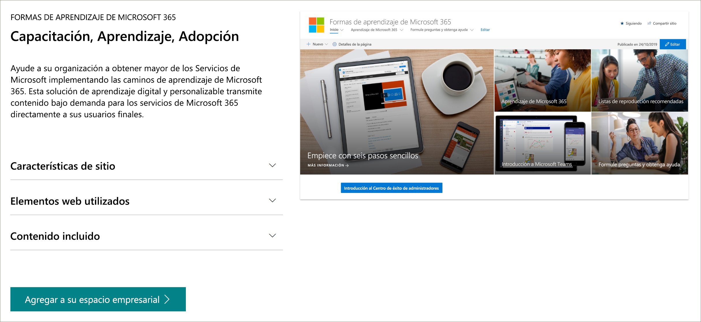

# Versión preliminar de Microsoft 365 Learning Pathways
Microsoft 365 Learning Pathways es una solución de aprendizaje personalizada y a petición diseñada para aumentar el uso y la adopción de los servicios de Microsoft 365 en su organización.  

## Formación personalizada y a petición de Microsoft

Microsoft 365 Learning Pathways ofrece:

- **Un sitio de comunicación de SharePoint Online completamente personalizable** : el portal de aprendizaje de las rutas de aprendizaje se puede personalizar para agregar la ayuda, soporte técnico y contenido de la comunidad de su organización.
- Aprovisionamiento **sencillo** : aprovisione rutas de aprendizaje del servicio de aprovisionamiento de SharePoint Online con tan solo unos pasos sencillos
- **La capacidad de crear sus propias listas de reproducción de formación** (con caminos de aprendizaje), puede crear listas de reproducción de aprendizaje dirigidas para satisfacer las necesidades específicas de su entorno.
- Los caminos actualizados de aprendizaje de **contenido** proporcionan contenido a través de un catálogo de contenido de Microsoft online, por lo que el contenido de su sitio se actualiza periódicamente

# Servicio de aprovisionamiento de SharePoint Online 
Las rutas de aprendizaje se pueden aprovisionar desde el servicio de aprovisionamiento de SharePoint Online. Cuando se aprovisionan las rutas de aprendizaje de Microsoft 365, las organizaciones obtienen un sitio de comunicación de SharePoint Online diseñado para ser un portal de aprendizaje, junto con un elemento Web caminos de aprendizaje conectado a un catálogo en línea de contenido de aprendizaje. 

## 3 pasos sencillos
Comencemos a crear una experiencia de rutas de aprendizaje para su entorno.
1. Elija una [opción de configuración](custom_setupoptions.md) y aprovisione los caminos de aprendizaje de Microsoft 365.  
2. Personalización de caminos de aprendizaje para su entorno.
3. Comparta caminos de aprendizaje con sus usuarios mediante nuestras [herramientas de adopción](driveadoption.md).

## Comentarios y soporte técnico

Microsoft 365 Learning Pathways es un proyecto de código abierto compatible con nuestra [lista de problemas en línea](https://aka.ms/CustomLearningHelp) en github. La solución de vías de aprendizaje y sus componentes no están cubiertos por ningún contrato de soporte técnico de Microsoft existente.  

## Otros recursos
Puede usar el sitio de caminos de aprendizaje de Microsoft 365 para proporcionar vínculos a los foros de la comunidad de usuarios nuevos o existentes. Considere la posibilidad de iniciar un grupo de usuarios internos, si aún no dispone de uno, para permitir que los usuarios compartan su éxito y aprendan unos de otros.  Si no tiene tiempo para cultivar a un grupo de usuarios internos, usted y sus empleados pueden unirse a [Microsoft Office 365 Champion Community](https://aka.ms/O365Champions) para obtener formación mensual, pertenencia a la comunidad en línea y acceso anticipado a herramientas y recursos para Office 365.