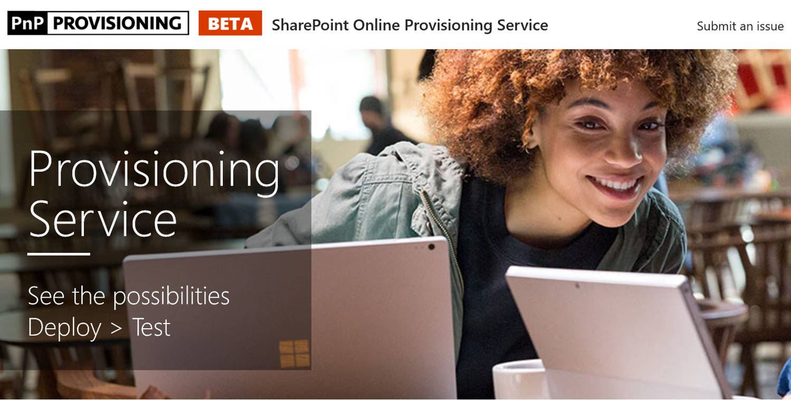

# Aprovisionar personalizados sitio de aprendizajeProvision the Custom Learning Site

1. Vaya a http://provisioning.sharepointpnp.com y planificación del inicio de sesión con sus credenciales para el destino de inquilinos en uso para la instalación. Go to http://provisioning.sharepointpnp.com and sign in using your credentials for the targeted tenant you plan on using for the installation. 
1. Comprobar el consentimiento en nombre de la organización y seleccione Aceptar.Check off Consent on behalf of your organization and select Accept.
1. Seleccione aprendizaje personalizado para Office 365 desde la Galería de soluciones.Select Custom Learning for Office 365 from the solution gallery. 
1. Seleccione Agregar a su inquilinoSelect Add to your Tenant 
1. Ajustar selecciones predeterminadas en la página de aprovisionamiento como provisión necesaria y seleccione cuando esté listo para instalar CLO365 en su entorno de inquilinos.Adjust default selections on the provisioning page as required and select Provision when ready to install CLO365 into your tenant environment.  
1. El proceso de aprovisionamiento tardará hasta 15 minutos. Se le notificará a través de correo electrónico (a la dirección de correo electrónico de notificación que escribió en la página de aprovisionamiento) cuando el sitio está listo para el acceso.The provisioning process will take up to 15 minutes. You will be notified via email (to the notification email address you entered on the Provisioning page) when the site is ready for access. 
1. Una vez iniciado sesión en CLO365 en el inquilino, favorito del sitio y copie la dirección url para futuras referencias.Once logged on to CLO365 in your tenant, favorite the site and copy the url for future reference.  

## Pasos siguientesNext Steps
- Explore el [contenido predeterminado](sitecontent.md) incluido en el elemento Web.Explore the [default content](sitecontent.md) included in the webpart.
- [Personalizar](customization.md) la experiencia de aprendizaje para la organización.[Customize](customization.md) the training experience for your organization.
- [Impulsar la adopción](driveadoption.md) de la solución de formación.[Drive adoption](driveadoption.md) of your training solution.

