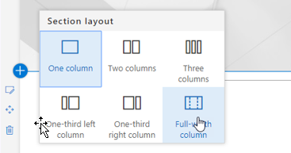
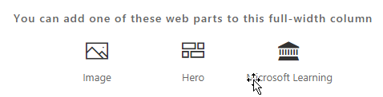

# Instalación del elemento Web de solución de aprendizaje personalizadaInstalling the Custom Learning Solution Webpart

## Requisitos previos para una instalación de todo el espacio empresarialPrerequisites for a tenant-wide installation

- Para instalar el elemento Web de aprendizaje personalizado para todo el espacio empresarial, tendrá que tener permisos administrativos de Office 365.  Si no dispone de estos permisos, puede trabajar con el administrador de Office 365 o instalar el elemento Web para una colección de sitios individual.To install the Custom Learning webpart for your entire tenant you will need to have Office 365 Administrative permissions.  If you do not have these permissions you can either work with your Office 365 Administrator or install the webpart for an individual site collection.
- Usted o el administrador de Office 365 debe tener la instalación y configurar un [Catálogo de aplicaciones](https://docs.microsoft.com/en-us/sharepoint/dev/spfx/set-up-your-developer-tenant) para todo el inquilino o un catálogo de aplicaciones de [colección de sitios](https://docs.microsoft.com/en-us/sharepoint/dev/general-development/site-collection-app-catalog)para recibir el elemento Web.]You or your Office 365 Administrator must have setup and configured a tenant-wide [App Catalog](https://docs.microsoft.com/en-us/sharepoint/dev/spfx/set-up-your-developer-tenant) or a [Site Collection App Catalog](https://docs.microsoft.com/en-us/sharepoint/dev/general-development/site-collection-app-catalog)to receive the webpart.]
- Solo admitimos SharePoint Online. El elemento Web no es compatible con la instalación en ninguna versión de SharePoint local.We support SharePoint Online only. The web part is not support for installation on any version of SharePoint on premises.

## Agregar el elemento Web de aprendizaje personalizado al espacio empresarialAdd the Custom Learning webpart to your tenant 

1. Descargue el elemento Web de aprendizaje personalizado y guárdelo en su unidad local.  Este archivo se denomina "MS-Custom-Learning. sppkg".  No cambie el nombre o el sufijo del archivo.Download the Custom Learning webpart and save it to your local drive.  This file is named "ms-custom-learning.sppkg".  Do not change the name or suffix of the file. 
2. Vaya al [portal de administración de Office 365](https://admin.microsoft.com/AdminPortal/Home#/homepage) para su espacio empresarialNavigate to the [Office 365 Admin portal](https://admin.microsoft.com/AdminPortal/Home#/homepage) for your tenant
3. En el panel de navegación izquierdo, seleccione centros de administración, SharePoint. Se abrirá en una nueva pestaña., en el centro de administración de SharePoint, seleccione aplicaciones, catálogo de aplicaciones, aplicaciones para SharePointFrom the left navigation select Admin Centers, SharePoint. This will open in a new tab. , In the SharePoint Admin Center select Apps, App Catalog, Apps for SharePoint 
4. Seleccione cargar el elemento Web y elija el archivo "MS-Custom-Learning. sppkg" que ha descargado.Select upload the webpart and choose the "ms-custom-learning.sppkg" file you downloaded
5. Para esta instalación de todo el espacio empresarial, marque la casilla que hay junto a "hacer que esta solución esté disponible en todos los de la organización".For this tenant-wide installation check the box next to "Make this solution available to all sits in the organization."  
 
> [!NOTE]
> Una vez instalado el elemento Web, lo encontrará en la galería de elementos Web en SharePoint Online.  **En la galería, el elemento Web se denomina "aprendizaje de Microsoft"**Once the webpart is installed you will find it in your webpart gallery in SharePoint Online.  **In the gallery the webpart is named "Microsoft Learning"**

## Agregar el elemento Web de Microsoft Learning a una página de SharePoint OnlineAdd the Microsoft Learning webpart to a SharePoint Online Page

Una vez instalado aprendizaje personalizado en el espacio empresarial, puede Agregar el elemento Web a una página de SharePoint. Cuando se hace que el aprendizaje de Office 365 y Windows 10 esté disponible en el sitio.After Custom Learning is installed in your tenant you can add the Web part to a SharePoint page. When you do Office 365 and Windows 10 training is available to your site.

1. Agregue el elemento Web de aprendizaje personalizado en un diseño de columna de ancho completo:Add the Custom Learning webpart in a full width column layout:

2. En la página de SharePoint, seleccione Agregar sección y, a continuación, seleccione columna de ancho completo.  Verá el siguiente mensaje:In the SharePoint page, select Add section and then select full width column.  You'll see the following prompt:

3. Seleccione Microsoft Learning.  Ahora debería ver lo siguiente:Select Microsoft Learning.  You should now see the following: 

 Ahora puede hacer clic en los mosaicos para explorar el contenido predeterminado incluido en la solución.You can now click on the tiles to explore the default content included in the solution.  

### Pasos siguientesNext Steps
- Explore el [contenido predeterminado](webpartcontent.md) incluido en el elemento Web.Explore the [default content](webpartcontent.md) included in the webpart.
- [Personalice](customization.md) la experiencia de aprendizaje para su organización.[Customize](customization.md) the training experience for your organization.
- [Impulsar la adopción](driveadoption.md) de la solución de formación.[Drive adoption](driveadoption.md) of your training solution.

