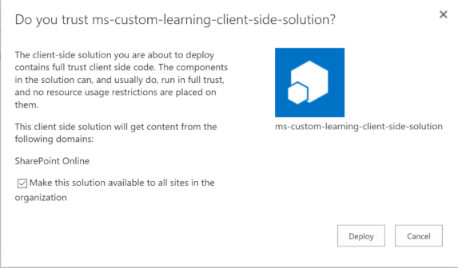
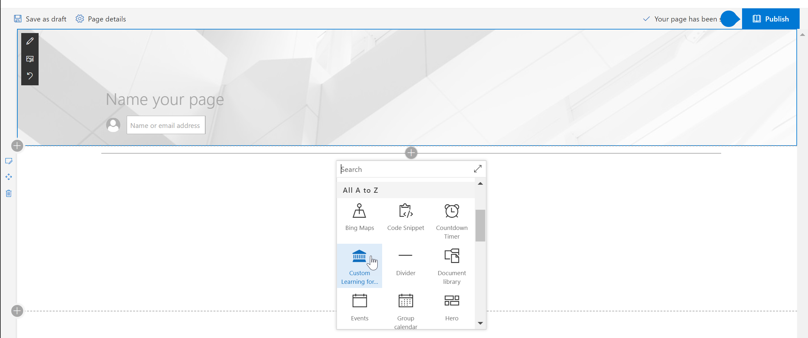

# Instalación del elemento Web de solución de aprendizaje personalizada

## Requisitos previos para una instalación de todo el espacio empresarial

- Para instalar el elemento Web de aprendizaje personalizado para todo el espacio empresarial, tendrá que tener permisos administrativos de Office 365.  Si no dispone de estos permisos, puede trabajar con el administrador de Office 365 o instalar el elemento Web para una colección de sitios individual.
- Usted o el administrador de Office 365 debe tener la instalación y configurar un [Catálogo de aplicaciones](https://docs.microsoft.com/en-us/sharepoint/dev/spfx/set-up-your-developer-tenant) para todo el inquilino o un catálogo de aplicaciones de [colección de sitios](https://docs.microsoft.com/en-us/sharepoint/dev/general-development/site-collection-app-catalog)para recibir el elemento Web.]
- Solo admitimos SharePoint Online. El elemento Web no es compatible con la instalación en ninguna versión de SharePoint local.

## Agregar el elemento Web de aprendizaje personalizado al espacio empresarial 

1. Descargue el elemento Web de aprendizaje personalizado y guárdelo en su unidad local.  Este archivo se denomina "MS-Custom-Learning. sppkg".  No cambie el nombre o el sufijo del archivo. 
2. Vaya al [portal de administración de Office 365](https://admin.microsoft.com/AdminPortal/Home#/homepage) para su espacio empresarial
3. En el panel de navegación izquierdo, seleccione centros de administración, SharePoint. Se abrirá en una nueva pestaña., en el centro de administración de SharePoint, seleccione aplicaciones, catálogo de aplicaciones, aplicaciones para SharePoint 
4. Seleccione cargar el elemento Web y elija el archivo "MS-Custom-Learning. sppkg" que ha descargado.
5. Para esta instalación de todo el espacio empresarial, marque la casilla que hay junto a "hacer que esta solución esté disponible en todos los de la organización".  
 
> [!NOTE]
> Una vez instalado el elemento Web, lo encontrará en la galería de elementos Web en SharePoint Online.  **En la galería, el elemento Web se denomina "aprendizaje de Microsoft"**

## Agregar el elemento Web de Microsoft Learning a una página de SharePoint Online

Una vez instalado aprendizaje personalizado en el espacio empresarial, puede Agregar el elemento Web a una página de SharePoint. Cuando se hace que el aprendizaje de Office 365 y Windows 10 esté disponible en el sitio.

1. Agregue el elemento Web de aprendizaje personalizado en un diseño de columna de ancho completo:

2. En la página de SharePoint, seleccione Agregar sección y, a continuación, seleccione columna de ancho completo.  Verá el siguiente mensaje:

3. Seleccione Microsoft Learning.  Ahora debería ver lo siguiente: 

 Ahora puede hacer clic en los mosaicos para explorar el contenido predeterminado incluido en la solución.  

### Pasos siguientes
- Explore el [contenido predeterminado](webpartcontent.md) incluido en el elemento Web.
- [Personalice](customization.md) la experiencia de aprendizaje para su organización.
- [Impulsar la adopción](driveadoption.md) de la solución de formación.

