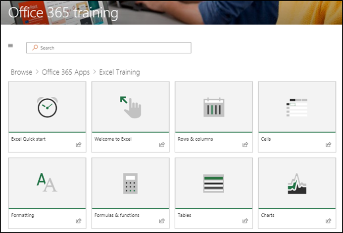
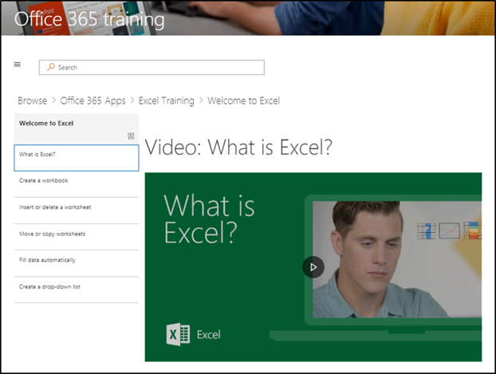

# Explorar el sitio y el contenido predeterminadoExplore the site and default content

### Paseo por el sitioTour the site 

Navegue a la Página principal y seleccione Office 365 Training. Cada página del sitio de SharePoint Online está configurada para hospedar el elemento Web de Microsoft Learning. Esto permite que la página muestre todo el contenido disponible en el elemento Web.Navigate to the Home page and select Office 365 Training. EAch page in the SharePoint Online site is configured to host the Microsoft Learning webpart. This enables the page to  display all the content available within the webpart.

En la barra de menús, seleccione el elemento de navegación **Office 365 Training** y, a continuación, seleccione Introducción **a OneDrive**. En este caso, el elemento Web filtra el contenido para mostrar solo el contenido de OneDrive.From the menu bar, select the navigation item **Office 365 Training** and then select **Get Started with OneDrive**. In this case, the Web part filters the content to show only OneDrive content.

Repita estos pasos para las otras dos opciones de menú, **empiece a trabajar con** Microsoft Teams y empiece a **trabajar con SharePoint Online** para revisar el contenido y probar la navegación.Repeat these steps for the other two menu options, **Get Started with Teams** and **Get Started with SharePoint Online** to review their content and test the navigation.

Vuelva a la Página principal y seleccione **comenzar con seis pasos sencillos**. Esto le llevará a la lista de reproducción de los seis pasos sencillos.Navigate back to the Home page and select **Start with Six Simple Steps**. This takes you to the Six Simple Steps playlist.

> [!TIP]
> Los seis pasos sencillos provienen de un equipo de investigación de Microsoft. Estos son los pasos que los investigadores de Microsoft han descubierto que son los más precisos, es decir, si los usuarios pasan por estos pasos, el uso de Office 365 aumentará y se convertirán en trabajadores más productivos. Y eso es bueno para todos.The Six Simple Steps are derived from a Microsoft research team. These are the steps that Microsoft researchers have found to be the most sticky, meaning if users go through these steps, their use of Office 365 will increase and they will become more productive workers. And that’s good for everybody.

### Vaya a empezar con seis pasos sencillosGo to Start with Six Simple Steps
- En la Página principal, haga clic en comenzar con seis pasos sencillos.From the Home page, click Start with six simple steps. 
- Ve la página de formación de Office con el elemento Web de aprendizaje personalizado enrutado al principio con seis sencillos lista de reproducción de pasos.You see the Office Training page with the Custom Learning web part routed to the Start with six simple steps playlist.  

### Ver una lista de listas de reproducción de una categoríaView a list of playlists for a category

En la página de aprendizaje de Office 365, seleccione aprendizaje de Excel para ir a una lista de listas de reproducción de aprendizaje de Excel.From the Office 365 training page select Excel Training to go to a list of Excel Training playlists.

### Ver una lista de reproducciónView a Playlist

Haga clic en **Bienvenido a Excel** para ver la lista de reproducciónClick **Welcome to Excel** to view the playlist

El sitio ya está configurado con el contenido correcto que se muestra en cada página.Your site is now set up with the correct content being displayed on each page. 

## Pasos siguientesNext Steps
- [Personalización del contenido del sitioCustomize site content](customization.md)
- [Adopción de unidadesDrive adoption](driveadoption.md) 
