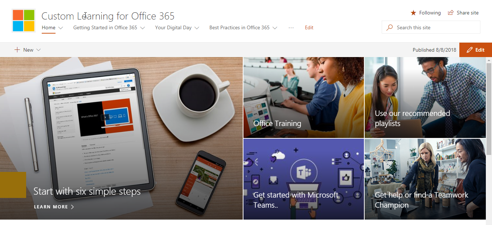

# Elemento Web de formación y contenido de sitio

Vamos a revisar el contenido proporcionado en este conjunto de soluciones.  Comenzaremos con el contenido del elemento Web que se transmite directamente 

Los seis pasos simples se derivan de un equipo de investigación de Microsoft. Estos son los pasos que se han encontrado investigadores de Microsoft a ser más rápidas, lo que significa que si los usuarios que se pasan a través de estos pasos, aumentará su uso de Office 365 y se convertirán en los trabajadores más productivos. Y que es buena para todo el mundo.

Vaya a empezar con seis sencillos pasos
- En la página principal, haga clic en Inicio con seis sencillos pasos. 
- Vea la página de formación de Office con el elemento web de aprendizaje personalizado enrutado al inicio con lista de reproducción de seis sencillos pasos.  

