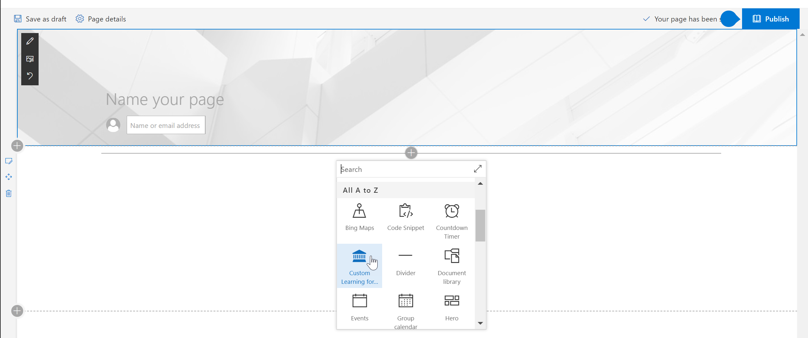
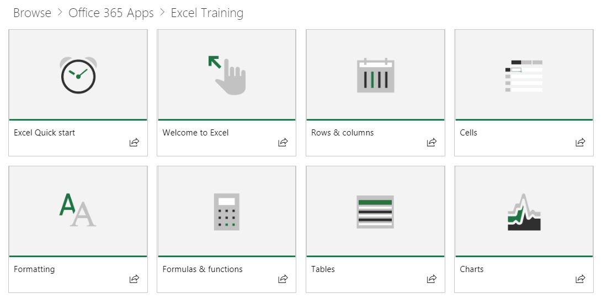
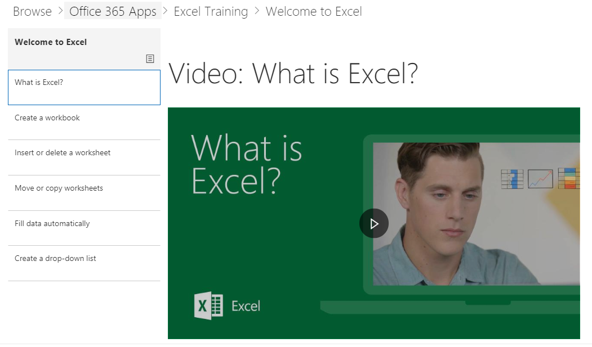

# Contenido predeterminado del elemento Web

## El modelo de lista de reproducción

Nuestro webpart usa un modelo de lista de reproducción familiarizado para organizar el contenido.  Este modelo es sencillo para los usuarios finales a comprender y que se puede personalizar si decide.  No se requiere la personalización.  Desconectarse de la experiencia del cuadro proporciona contenido de aprendizaje eficaz basado en nuestra investigación extensa.

Estas listas de reproducción están diseñados para ayudar a las organizaciones adaptar la experiencia de aprendizaje para usuarios y presentarlos con listas de reproducción consumir a Enséñeles comportamientos nuevos y más productivos. El contenido de servir de Support.Office.com y los activos son cortos y concisos, con vídeos peppy, atractivos. 

Cada icono representa una lista de reproducción destacado individual o una categoría de contenido. Al hacer clic en cualquier icono de lista de reproducción o categoría rápidamente, el usuario desplaza en el área seleccionada. El siguiente gráfico muestra ambas listas destacadas en categorías "Get Started lista de reproducción" y la aplicación de Office 365 como Excel, Microsoft Teams y otros usuarios. 

Al hacer clic en la categoría de Excel por ejemplo se desplaza ellos a una colección de listas de reproducción.  Pueden ver contenido en orden o seleccione lo que les interesa en función de sus necesidades de aprendizaje. 

Selecciona la vista de lista de reproducción

## Pasos siguientes

- Busque y familiarícese con el contenido existente
- Continúe con la [personalización de listas de reproducción](customplaylists.md)